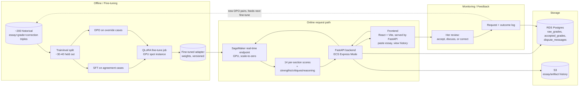

# AP Lit Essay Grader

<!--
This document is structured as frozen + living sections.

[frozen] sections capture decisions made at scoping time. They are immutable.
If a frozen decision changes, that's a re-grill, not an edit. The Decisions log
captures the change with a date and reason. The original section stays.

[living] sections reflect current state and are updated as the project progresses.
Claude Code maintains living sections during implementation. Always update the
last_updated date when changing a living section.
-->

## Why  [frozen]

### End goal

Your wife pastes a student essay into an app and gets back scores + improvement-oriented comments for every section of the school's actual AP Lit essay rubric (Thesis, Body Paragraph #1's Claim/Evidence 1/Reasoning 1/Evidence 2/Reasoning 2/Synthesis, Body Paragraph #2's same six, Conclusion — each 1-4, or flagged as missing when the essay doesn't address that criterion at all) without opening Claude.ai and re-explaining the rubric each time. This replaces an existing informal workflow (grading via raw Claude/ChatGPT conversations) that has a known, specific failure: models struggle to cleanly separate a 3 from a 4 on individual criteria, especially Evidence, which is her current lowest-trust section. The tool is built for her class today, with an explicit eye toward generalizing to other teachers and possibly commercializing later — but that generalization is not assumed to work automatically (see Deliberately deferred).

### Why now

Prior informal grading attempts (raw OpenAI API and raw Claude) were unsatisfying: OpenAI's model graded poorly overall, and Claude specifically struggled to differentiate adjacent scores (3 vs. 4) on rubric criteria. A fine-tuning pass targeted specifically at this known failure mode, using ~200 of her own real (essay, Claude's grade, her correction) triples as training signal, is a tractable, scoped way to fix the actual problem rather than hoping a better prompt fixes it.

### Business metric

Weekly active usage: did she (and eventually other teachers) open the app and grade at least one essay in a given week. This is the adoption/retention signal — a model that grades well but that she doesn't keep using has not achieved the end goal.

Secondary/diagnostic metric: time spent per grading session, expected to trend down as the fine-tune internalizes her grading style. This metric is explicitly *not* allowed to stand alone — a falling time-per-essay paired with a rising override rate would indicate she's rubber-stamping output rather than reviewing carefully, which is a failure, not a success. Time-per-essay is only trustworthy when read alongside override rate/magnitude.

### Expected lift over heuristic baseline

Two heuristic baselines, tracked separately because they answer different questions:

1. **Claude API zero-shot** (no fine-tuning) — the real-world floor. If the fine-tuned open model can't beat this, the honest conclusion is "don't self-host, just use the Claude API directly."
2. **Chosen open-weight base model, zero-shot** (before LoRA/DPO) — isolates whether fine-tuning itself did anything, separate from base model strength.

Both are already known to have the adjacent-score-boundary problem (per your wife's direct experience with Claude specifically). Expected lift is not "better on average" — it's specifically "better at separating adjacent scores (e.g. 3 vs. 4) on individual rubric criteria." A generic aggregate accuracy improvement that doesn't touch the boundary-confusion problem does not count as success (see Kill criteria in Phase 2, and Decisions log).

## What  [frozen]

### Models

#### ap-lit-grader

**Decision the model informs**: What score (1-4), or a missing flag, and structured improvement feedback to assign to each section of a student's AP Lit essay, evaluated against the school's real classroom rubric.

**Chosen ML framing**: Single model, single-turn, structured generation. Given (essay text, rubric), the model outputs 14 sub-scores — one per rubric criterion: Thesis, Body Paragraph #1 × 6 criteria (Claim, Evidence 1, Reasoning 1, Evidence 2, Reasoning 2, Synthesis), Body Paragraph #2 × the same 6, Conclusion — each either a 1-4 scale or an explicit "missing" flag when the essay contains no content addressing that criterion. Per-criterion output is structured, not a single rationale blob: a `strengths[]` list, a `critiques[]` list, and a separate `reasoning` field explaining how the score was derived against the rubric's score-band boundaries (this last field is what lets her see *why* the model landed where it did when she disagrees — see Data model below). All generated in a single call when the full essay is provided. Fine-tuned via QLoRA (PEFT) using SFT on agreement cases (she accepted Claude's original grade) and DPO on override cases (her correction preferred over Claude's original grade) — roughly 200 historical triples, ~70% override / ~30% agreement.

**Rejected framings**:

| Framing | Why rejected |
|---|---|
| Two-model split (separate scorer + comment generator) | Unnecessary — one fine-tuned model can generate structured score + rationale in one call; no upstream/downstream dependency exists between "what's the score" and "why." |
| Holistic single 0-6 score (original brief's assumption) | Does not match reality. The actual rubric is 14 per-section criteria scored 1-4 each; there is no official AP exam 0-6 conversion in use. Corrected during scoping (see Decisions log). |
| Multi-turn conversational grading (preserving the back-and-forth from historical Claude conversations) | Serving format is locked as single-turn (essay + rubric in, result out). Training examples use the *resolved end-state* of the historical back-and-forth (her final score + reasoning), not the intermediate argument, to keep training-serving parity. The live, in-app version of this back-and-forth (the dispute/discussion flow) is a separate, explicit UI feature — see UI/UX design below — not a return to multi-turn serving. |
| Rubric negotiation chat before grading | Reopens the locked single-turn serving format and has zero training-data coverage (all 200 historical triples used one fixed rubric). Deferred as a Phase 2+/commercialization feature for multi-teacher use, not built now. |

**Functional requirements**:
- Given a full essay + the fixed AP Lit classroom rubric, return all 14 per-section outputs (each a 1-4 score, or a missing flag) plus structured `strengths[]`, `critiques[]`, and `reasoning` in one generation.
- Each per-criterion output must include enough span/location information (e.g. character offsets into the submitted essay) for the UI to anchor its feedback next to the exact text it refers to. Exact mechanism (model-emitted offsets vs. a separate alignment step) is an open question — see Open questions.
- A criterion must be distinguishable as "missing" (no content in the essay addresses it) from "present but weak" (scored 1). These are different signals for both the teacher and the training pipeline and must not collapse into the same score.
- Support partial-essay grading (e.g., evidence-only, thesis-only, or any combination of individual criteria) via prompt routing to a subset of the same rubric structure. This mode is functionally supported in Phase 1 but explicitly **unvalidated** — no training data or held-out eval coverage exists for it yet (see Open questions).
- Capture her full review outcome after every grading — not just the final accepted/corrected score, but the complete discussion transcript when she disputes a score, since the transcript (not just the outcome) is what makes a correction usable as training signal. See Data model below for the storage shape this implies.

**Non-functional requirements**:
- Latency: synchronous request/response, up to ~60-90s worst-case tolerable (covers cold start on a scale-to-zero endpoint), with a visible loading state in the UI.
- Volume: single teacher initially (low, bursty traffic — grading happens in sessions, not continuously), designed to extend to a handful of teachers later.
- Retraining cadence: not fixed — re-fine-tune as enough new corrected triples accumulate post-launch (flywheel via feedback capture).
- Reliability: no formal SLA (n=1 user); failure mode should be a visible error state in the UI, not a silent hang.

## How  [living, last_updated: 2026-08-11]

### Methodology

**Label**: On override cases (~70% of the ~200 triples), the label is her corrected score(s) + her corrected rationale — this is a DPO preference pair (rejected: Claude's original grade, preferred: her correction). On agreement cases (~30%), the label is Claude's original grade, treated as an SFT confirmation example (no preference pair, since there was no disagreement). All labels are per-section (14 sub-scores), not a single holistic number. How a "missing" criterion should be weighted in training and in QWK reporting (e.g. does a corrected missing→1 count as an override case the same way a corrected 3→4 does) is not yet decided — see Open questions.

**Leakage audit**: Feature set is essay text + fixed rubric only. Historical grading conversations were confirmed to be "grade this essay against the rubric, then back-and-forth on why the grade was wrong" — no student identity, history, or other out-of-band context was included, so there is no leakage risk from those sources. The back-and-forth itself is not used as training input (see training-serving parity below); only the resolved final state is.

**Population match**: All ~200 training triples are from your wife's own classes and assignment prompts. This is expected and correct for Phase 1 (the fine-tune is intentionally her personal grading-style delta). Explicit limitation: this is *not* a generalized AP Lit grader — if Phase 2 expands to other teachers with different rubrics or grading philosophies, the model may need retraining or a different approach per teacher. Not assumed to generalize automatically.

**Feature engineering**: None beyond the essay text and the fixed rubric text baked into the prompt template. Rubric is a constant for Phase 1, not a variable input — no parity risk there.

**Model family**: 7-8B open-weight instruction-tuned LLM, QLoRA/LoRA fine-tuned (SFT + DPO via PEFT/TRL). Base model choice is being hedged in Phase 0 between **Qwen2.5-7B-Instruct** (Apache 2.0 license, model card explicitly targets structured/JSON-style output which matches the 14-sub-score generation requirement) and **Llama 3.1 8B** (larger fine-tuning community/tooling maturity, Meta's custom license with a 700M MAU commercial cap that doesn't bite at this scale but is worth reviewing before any commercialization). Decision will be made from real zero-shot output quality on the same essay sample, not from benchmarks alone.

**Training-serving parity**: Training examples are built from the *resolved end-state* of historical multi-turn grading conversations (essay, rubric → her final per-section scores + rationale), matching the single-turn serving format exactly. The intermediate back-and-forth argument is a source for constructing DPO pairs (Claude's initial guess = rejected, her final = preferred) but is not itself part of any training example's input. The in-app dispute feature (see UI/UX design) is the live equivalent of this historical back-and-forth, and is what will generate this same shape of data going forward.

### Data model

Discovered while designing the UI's dispute/correction flow: "the model's original grade" and "the score that actually counts" need to be two different records, not one row with a status flag, because they have different write behavior and different consumers.

- **`raw_grades`** — append-only event log. One row per model generation: the initial grade, any re-grade, and any score Claude proposes mid-dispute. Never edited. Written automatically the moment Claude responds — this is a system event, not a teacher decision, so it autosaves with no confirmation step.
- **`accepted_grades`** — also append-only, read as "latest row per (essay, criterion) wins." One row per explicit teacher action: her initial silent acceptance (created in bulk the moment she hits "Finish grading" on an essay, for every criterion she never disputed) or a deliberate "Save correction" inside a dispute thread. Each row carries a foreign key back to the `raw_grades.id` it's confirming or correcting, which is what turns "she picked 3" into a usable DPO pair — the FK points at exactly which model output is the rejected side. This table is the one source of truth for "what score does this essay currently show," and per the autosave-vs-explicit-save principle below, it is never written to implicitly.
- **`dispute_messages`** — one row per turn in a discussion thread, scoped to (essay, criterion). This is what makes a correction legible later: `accepted_grades` says "3, not 4," `dispute_messages` says why.

An **agreement case** (SFT) is an `accepted_grades` row whose `raw_grade_id` FK points to a raw score that matches the accepted value. An **override case** (DPO) is where they differ. No separate classification logic is needed — it falls out of comparing the two tables.

**Autosave-vs-explicit-save principle** (governs all of the above): system-generated events autosave with no confirmation, because there's no ambiguity about intent and no downstream training-data event tied to a single click. Anything that becomes the *operative* score — shown to the student, feeding the essay's overall grade, or entering the training pipeline as a preference label — requires a deliberate action, because exploratory clicking (comparing 2 vs. 3 vs. 4 against the rubric) is expected, legitimate behavior that must not each independently commit a training label.

### System architecture

### UI/UX design

Fully designed during a dedicated UI session; a working interactive mockup (`ap-lit-grader-full-flow.jsx`) and a full design/interaction handoff doc (`UI-DESIGN-HANDOFF.md`) exist alongside this README and are the source of truth for frontend implementation. Summary for context:

- **Flow**: one-time-per-batch assignment setup (which criteria to grade, the prompt, the class) → a cached session bar shown above every subsequent essay so she never re-answers "what am I grading" per essay → paste essay → loading (real elapsed-time counter, no fake progress bar, since actual duration is variable) → full graded view → "Finish grading" (which is also the moment untouched criteria get bulk-accepted into `accepted_grades`) → straight into the next essay, cached bar intact.
- **Grading view**: all 14 criteria shown expanded simultaneously, grouped by essay part (Thesis / Body ¶1's six / Body ¶2's six / Conclusion) rather than one flat list, each with its own strengths/critiques, a collapsed "show model's reasoning" disclosure, and its own independent dispute thread.
- **Dispute feature**: this is the productized replacement for the ad-hoc Claude.ai back-and-forth described in Why Now. She can discuss any single criterion with Claude and, at resolution, must explicitly pick and save a final score — Claude's own proposed score is never auto-applied.
- **Missing-criterion handling**: visually and linguistically distinct from a low score everywhere it appears (a `!` marker instead of a number, a dashed inline placeholder in the essay itself where the missing content should have been, different copy in the margin card and in the simulated dispute reply).
- **Design system**: warm paper surface for the essay itself (legibility takes priority over theme), a pale lavender chrome, a dark plum accent card for feedback and system chrome, Petrona (serif) for the essay body, Inter for UI text, Caveat (handwritten) reserved for small flourishes only, never for anything that needs to be read carefully. (Originally speced as Fraunces; swapped to Petrona during the frontend build — see `UI-DESIGN-HANDOFF.md`.)

**Implementation status**: the design above is no longer just spec — it's built. `frontend/` is a real Vite + React + TypeScript + Tailwind app (per Tech stack below), built test-first with Vitest + React Testing Library, covering every screen in the flow with 43 passing tests. Still blocked on backend work: the Graded view renders fixture data regardless of what's pasted (no model endpoint yet), and the class list is still hardcoded. Places where the real build deliberately diverges from the reference mock's shortcuts (exact surface colors instead of nearest Tailwind defaults, the dispute finalize-picker requiring an explicit click rather than auto-applying Claude's suggestion, Paste/Loading/Graded all full-width instead of the mock's sidebar layouts) are documented inline in `UI-DESIGN-HANDOFF.md` as they were made.

## Offline-to-business validation plan

Claim: closing the per-section adjacent-score gap (e.g. 3 vs. 4, especially on Evidence, her current lowest-trust criterion) is what converts "I'll double-check everything myself" into "I trust this enough to review and adjust." A generic aggregate QWK improvement that doesn't touch adjacent-score confusion is not expected to move usage.

Since there's no real production A/B traffic (single user), validation is: after each fine-tuning iteration, (1) run the held-out eval and report per-criterion QWK + adjacent-pair (3-vs-4, etc.) confusion matrices, and (2) directly ask her whether that version's output feels trustworthy enough to rely on for boundary cases — a qualitative check that, at n=1, is more direct signal than any offline number alone.

Re-confirmed late in scoping (after the real rubric was discovered) — the causal story held up: per-section boundary accuracy, not a holistic score, is what needs to improve, and Evidence specifically is her known trust gap.

### Tech stack

| Layer | Choice | Why |
|---|---|---|
| Frontend | React (Vite) + TypeScript + Tailwind, built to static assets and served by the FastAPI backend as one deployable | Still one deployable, no CORS config needed in production (frontend assets served by the same FastAPI container); deployment now goes through an ECR image push rather than App Runner's old build-from-source-repo option, since ECS Express Mode requires a pre-built container image. Splitting to S3/CloudFront is a clean later migration if Phase 2+ adds auth/multi-tenancy. D3/recharts available for Phase 2 progress-tracking charts. |
| App backend | FastAPI on Amazon ECS (Express Mode) | AWS-native, reinforces existing resume line; Express Mode gives a simplified deploy (point at a container image, get an HTTPS endpoint + load balancing + autoscaling) while still creating real, inspectable ECS resources (cluster, task definition, service, ALB) — unlike App Runner, which stopped accepting new AWS customers 2026-04-30 and was never provisioned on this account. |
| Database | RDS Postgres | Structured storage for `raw_grades`, `accepted_grades`, `dispute_messages` (see Data model), plus Phase 2 pseudonymous per-student history. ECS Express Mode defaults to the account's default VPC, same as RDS, so the backend reaches RDS privately over the ECS service's security group — no public RDS endpoint needed (an improvement over App Runner, which doesn't sit in a VPC by default). |
| Object storage | S3 | Raw essay/artifact history |
| Inference | SageMaker real-time endpoint, GPU (e.g. ml.g5.xlarge), scale-to-zero | SageMaker Serverless Inference is CPU-only with a 6GB memory ceiling — cannot host a 7-8B model. Scale-to-zero real-time endpoint matches bursty, low-volume traffic while staying GPU-backed and AWS-native. |
| Fine-tuning | LoRA/QLoRA via PEFT; DPO on override pairs, SFT on agreement cases; TRL/Axolotl tooling | Matches ~200-example dataset size and 1-week timeline; DPO pairs come directly from her real corrections |
| Base model (hedged) | Qwen2.5-7B-Instruct vs. Llama 3.1 8B, decided in Phase 0 | Qwen: Apache 2.0, structured-output design. Llama: larger community/tooling. Testing both is cheap and was an explicit skill-building goal. |

### Cost estimate

- **Inference (scale-to-zero, light bursty usage)**: ~$5-15/month on the SageMaker endpoint itself
- **Rest of stack (RDS, S3, ECS Express Mode)**: ~$20-35/month combined
- **Training**: ~$5-20 per QLoRA/DPO run on a GPU instance (spot where possible); expect several runs while iterating, ~$50-100 one-time across the dev cycle
- **Total estimated**: ~$25-50/month steady-state + ~$50-100 one-time training cost. Not a meaningful constraint on this project.
- **Phase 0 Claude API per-essay cost (measured, not estimated)**: ≈$0.10-0.15/essay at `claude-sonnet-5` rates — see `MODEL-PERFORMANCE.md` for the per-step token/latency/cost breakdown. This is the piece the estimates above didn't cover (they're projected SageMaker infra cost for Phase 1, not Phase 0's actual Claude API usage).

### Phased plan

#### Phase 0 — Smallest end-to-end slice
**Goal**: Prove the full pipeline (data → model → serving → consumer) can be assembled at all, in parallel with learning QLoRA/DPO.
**Deliverables (original)**: Zero-shot (non-fine-tuned) Qwen2.5-7B-Instruct *and* Llama 3.1 8B deployed on SageMaker real-time scale-to-zero endpoints; bare FastAPI endpoint; minimal frontend (even raw HTML); tested against 3-5 real essays. Produces the zero-shot baseline numbers for both candidate base models.
**Revised deliverable (2026-08-12, see Decisions log)**: SageMaker hosting deferred to Phase 1 (being handled separately by the project owner); pipeline validated first against the Claude API instead — doubles as the "Claude API zero-shot" baseline above.
**Status (2026-08-14)**: backend built and tested — bare FastAPI (`POST /grade`), the 5-call pipeline against `claude-sonnet-5`, S3/local result logging, 91 tests passing. Frontend is now connected (real fetch client, sentence-centric rendering — see `FRONTEND-BACKEND-INTEGRATION.md`), but true end-to-end validation against the live API is still blocked: 4 live smoke-test attempts this session all failed inside the pipeline (`segmentation` or `body_1` steps returning malformed/self-inconsistent structured tool output), reproducibly per-essay. Live-model reliability, not wiring, is now the open item — not yet the full 3-5-essay validation this deliverable calls for.
**Kill criteria**: If SageMaker real-time scale-to-zero can't reliably host either 7-8B model within a reasonable cold-start window, reassess hosting choice (e.g. always-on with a stop/start schedule, or Bedrock Custom Model Import) before proceeding. Not yet evaluated — SageMaker work hasn't started.

#### Phase 1 — Grading + comments, full essay, single teacher
**Goal**: Working app that grades full essays against the real rubric (all 14 per-section outputs + structured feedback), fine-tuned on your wife's ~200 historical triples, used by her directly. Full UI already designed — see UI/UX design above and `UI-DESIGN-HANDOFF.md`.
**Deliverables**: FastAPI backend + SageMaker fine-tuned endpoint + the designed React frontend + RDS/S3 logging + feedback capture (accept/discuss/correct, per the `raw_grades`/`accepted_grades`/`dispute_messages` data model) built in from the start. Held-out eval (~30-40 essays, curated for adjacent-score coverage) reporting per-criterion QWK, adjacent-pair confusion matrices, and exact/off-by-one accuracy, compared against both heuristic baselines (Claude API zero-shot, chosen base model zero-shot).
**Status**: the frontend deliverable is done ahead of the rest — real Vite/React/TS/Tailwind app in `frontend/`, full flow test-covered (43 tests), now connected to the Phase 0 backend via a real fetch client and the resolved sentence-centric essay/criterion linking model (see `FRONTEND-BACKEND-INTEGRATION.md`). That backend is still the zero-shot Phase 0 baseline version, not this phase's fine-tuned one — SageMaker fine-tuned endpoint, RDS/S3 logging as designed here, and the held-out eval are still not started.
**Kill criteria**: If, after a full SFT+DPO pass, the held-out eval shows no measurable improvement over baseline on adjacent-score (e.g. 3-vs-4) boundary accuracy across rubric criteria, treat the grading-model approach as not working — pivot to a different value-add (e.g., comments-only without a hard score, or lean into progress-tracking as the real product) rather than continuing to iterate on the same fine-tune blindly.

#### Phase 2 — Pseudonymous per-student progress tracking
**Goal**: Let her see how a given (pseudonymous) student's per-section scores trend across multiple graded essays over time.
**Deliverables**: `students` table (pseudonymous IDs only, no real names/school IDs — real-name mapping stays outside the system), essays linked by student_id, progress-view UI.
**Kill criteria**: Not started until Phase 1's grading quality is solid and she's used it for several real weeks — building this before grading is trusted risks tracking progress against an untrustworthy signal.

### Definition of done

Phase 1 is "shipped" when your wife can paste a real essay into the deployed app, receive per-section scores + structured feedback against the real rubric within the latency budget, her review (accept/discuss/correct) is captured with full transcript, and the held-out eval shows measurable adjacent-score-boundary improvement over both baselines.

## Decisions log

- **2026-08-11**: Project scoped via grill-me. Locked end goal (per-section grading + comments, weekly-usage business metric), single-model topology, SageMaker real-time scale-to-zero GPU endpoint (Serverless Inference ruled out — CPU-only, 6GB cap), pseudonymous student IDs (FERPA/SOPPA-aware), Phase 1 (grading) vs. Phase 2 (progress tracking) split, QWK-based eval protocol, and Phase 0 base-model hedge (Qwen2.5-7B-Instruct vs. Llama 3.1 8B).
- **2026-08-11**: Mid-scoping correction — original brief assumed a holistic 0-6 AP-exam-style rubric. Actual rubric (uploaded by user) is a ~10-criterion, 1-4-per-criterion classroom rubric with no official AP exam score conversion in use. All label, eval, and off-ramp decisions revised to per-section 1-4 scale.
- **2026-08-11**: UI design session. Corrected rubric structure — each body paragraph has 2 pieces of evidence and 2 pieces of reasoning, not 1 each, bringing the true criterion count to 14, not ~10. All references updated. Locked the per-criterion structured output shape (`score|missing`, `strengths[]`, `critiques[]`, `reasoning`) in place of a single rationale blob — the separate `reasoning` field exists specifically to support the in-app dispute feature and downstream DPO-pair construction. Added explicit "missing" as a distinct state from a low score. Designed and locked the full UI flow, the `raw_grades`/`accepted_grades`/`dispute_messages` data model, and the autosave-vs-explicit-save principle (see Data model and UI/UX design above). Chose React (Vite) + TypeScript + Tailwind, served from FastAPI as one deployable, as the frontend stack.
- **2026-08-12**: Backend planning session, re-grill of the frozen "single fine-tuned model, single-turn, structured generation... all generated in a single call" decision. **New chosen framing**: a 5-call chained pipeline per essay — (1) a segmentation call splits the raw essay into structural sections + an indexed sentence list, since essays don't reliably have exactly 4 paragraphs; (2) a thesis call grades Thesis and extracts (or reconstructs, if absent) the argument as context for everything downstream, plus a bucketed confidence (`high`/`medium`/`low` + reason, tied to explicit criteria like "explicit thesis stated" vs. "inferred, not stated anywhere" — deliberately not a raw numeric self-reported confidence score, which LLMs are known to calibrate poorly); (3) a Body ¶1 call grades against "supports the thesis"; (4) a Body ¶2 call grades against "*completes* the support" (coverage/redundancy vs. ¶1, not just relevance), using the thesis plus a summary of what ¶1 already covered; (5) a Conclusion call grades it as a synthesis of both body paragraphs. **Why re-grilled**: matches the UI's independent per-criterion dispute threads — a disputed Evidence-1 score can re-run just the Body-¶1 call with her feedback, rather than re-running one giant composite generation and risking perturbing the other 13 criteria's scores. Also makes each criterion's DPO training signal cleaner (maps to exactly one call-type, not buried in a 14-part composite). **Tradeoff accepted**: her ~200 historical triples were one-shot (one long prompt, one response) — training-serving parity is not automatic under the new shape. Mitigation: before this pipeline structure is frozen for Phase 1 data collection, it will be run against a sample of her historical essays and diffed criterion-by-criterion against what she actually decided, to validate the new prompt structure doesn't drift from her real judgment. **Also decided**: span/offset (previously an Open question) resolved as sentence-index references, not raw character offsets or quoted-text fuzzy-matching — the segmentation call's indexed sentence list is the source of truth, grading calls reference sentence indices, and character offsets are computed server-side via lookup, which removes the "quote not found" failure mode a text-matching approach would have. **New tables added**, not in the original three-table sketch but required by it: `sessions` (cached assignment setup) and `essays` (pasted text) give the grade tables an entity to FK against; `essay_sentences` (written by the segmentation call) backs the sentence-index span resolution above.
- **2026-08-12 (cont'd)**: Two follow-up decisions on the pipeline above. **Dispute scope**: a dispute on one criterion re-runs its *entire section call* (e.g. disputing Evidence 1 re-generates all 6 Body ¶1 criteria), not just the disputed one — a correction can legitimately change how sibling criteria should read, so the model is deliberately not constrained to hold the others fixed. Only the criterion she actually disputed gets surfaced/finalized in the UI; the other freshly-generated `raw_grades` rows sit in the log, unlinked, until/unless she separately opens a dispute on those too. **Segmentation failure mode**: the segmentation call is always best-effort and never blocks — an essay with 3 body paragraphs, no clean breaks, etc. still gets forced into the 4-section shape — but the call must record what compromise it made (`essays.segmentation_notes`) rather than silently picking a split, mirroring the transparency principle behind the thesis confidence bucket.
- **2026-08-13**: Phase 0 backend built and unit/integration tested (85 tests), validated once against the real Claude API on a real essay (not yet the full 3-5-essay validation Phase 0's deliverable calls for). Two real bugs caught and fixed along the way: `.env` wasn't loaded by the actual running app (only by tests), and `GRADING_MODEL_VERSION` was set to a `raw_grades.model_version` bookkeeping label (`"claude-sonnet-5-zeroshot"`) rather than a real Anthropic API model ID (`"claude-sonnet-5"`) — both fixed. **Sentence splitting decided as fully deterministic**, not model-driven at all: a code-based tokenizer (not the LLM) computes exact sentence boundaries/offsets; the segmentation call only classifies each pre-split sentence into a section. Rejected having the model emit or reconcile offsets directly — LLMs are measurably unreliable at character-level counting (tokenization operates on sub-word units), confirmed via research check, not just intuition. **Frontend/backend integration scoped, not built**: the two have never been connected (frontend still renders fixture data). Found a real data-model incompatibility, not just missing wiring — the frontend's `EssayChunk` model (built 2026-08-11) assumes one contiguous text span per criterion; the backend's actual `sentence_refs` output (decided 2026-08-12) is many-to-many and can interleave (confirmed with real data: `bp2-evidence-2: [12, 15]` sandwiches sentences cited by `bp2-reasoning-2: [13, 14, 16]`). Full gap analysis in `FRONTEND-BACKEND-INTEGRATION.md`; recommendation is to resolve this data-model question before writing any frontend fetch code.

- **2026-08-14**: Frontend/backend connection built. Backend embeds `label`/`group` per criterion and exposes `section_of`/`citing_criteria` via Pydantic `@computed_field`s (additive — no changes to required fields, all 91 existing tests pass unchanged); backend's internal `body_1`/`body_2` section naming is converted to the frontend's `bp1`/`bp2` `SectionId` server-side, so the frontend never sees the backend's internal naming. CORS added for local dev only (hardcoded to Vite's default port — a Settings field would be speculative config for a prod deployment shape, static-served from FastAPI, that doesn't exist yet). Frontend gets a real fetch client (`frontend/src/api/grade.ts`) doing the one `criterion_id`→`id` rename in one seam, and `GradedView.tsx`'s rendering rewritten to the sentence-centric model designed 2026-08-13. **One correction to the draft `EssayLinking.types.ts`**: its `CriterionResult.group` was typed as `SectionId` (`"bp1"`), but the already-built `CriterionCard`/`RubricKey` components render `group` directly as a display string (`"Body ¶1"`, `null` for standalone) — kept as a display string, sourced as-is from `services/rubric.py`'s `RUBRIC` dict; `SectionId` stays scoped to `sectionOf`/missing-placement logic, where the two concerns never collide. **New finding, not part of this work**: live end-to-end validation is still blocked — 4 attempts against the real Claude API this session (2 different essays, one repeated) all failed *inside* the pipeline (`segmentation` or `body_1` steps returning malformed or internally-inconsistent structured tool output), reproducibly per-essay. Confirmed via `git diff` that this is pre-existing — nothing in `services/segmentation.py`, `services/inference.py`, or the pipeline was touched. This means the "validated on 1 of 3-5 real essays" status from 2026-08-13 was closer to a lucky run than a reliable baseline. **Diagnosed and fixed same day**: called the segmentation step directly against the live API to inspect the raw, unvalidated tool output — confirmed the model's actual section binning was correct, it had just double-encoded the `sentence_sections` array as a JSON string one level too deep (`{"sentence_sections": "{\"sentence_sections\":[...]}"}`) instead of returning it natively. Fixed generically in `services/inference.py`'s `generate_structured()` — repairs any array/object-typed field per the tool's declared JSON Schema when the model returns it double-encoded, leaves genuine string fields untouched — covered by 3 new unit tests and confirmed by replaying the exact essay that failed 3 times, which now segments correctly on the first try. The `body_1` failure (model returned `missing: true` with a non-null `score`) was also root-caused: replaying the same call showed the model citing a real sentence, giving it a real floor score (1), real critique text — and also flagging it missing, because nothing in any of the three grading prompts or tool schemas ever explained what `missing` should mean versus a floor score; the field name alone doesn't convey "nothing present at all" vs. "present but bad." Fixed by adding a shared `MISSING_FIELD_GUIDANCE` constant (`services/rubric.py`) to the thesis/body-paragraph/conclusion system prompts and to the `missing` field's schema `description` in all three. Replaying the exact case that crashed now returns internally-consistent output (the weak claim scores 1/not-missing; the genuinely absent criteria are null-score/missing). Both live-API failure modes found this session (segmentation double-encoding, body_1 missing/score inconsistency) are fixed as of 2026-08-14. Same session: a real end-to-end browser test succeeded first try (Playwright driver, real sample essay/prompt from repo root), and per-step latency/tokens/cost were measured against the live pipeline and written up in `MODEL-PERFORMANCE.md` — ≈70s and ≈$0.10-0.15/essay at intro `claude-sonnet-5` pricing, dominated by the two body-paragraph calls (68% of latency combined).

- **2026-08-15**: Authentication added end to end — single-teacher Cognito sign-in, not multi-tenant. Chosen framing: call Cognito's `USER_PASSWORD_AUTH` flow directly from the frontend (no AWS SDK, no API Gateway authorizer) rather than a library like Amplify, since there's exactly one admin-created user and no other Cognito-adjacent surface area needed yet. Frontend (`frontend/src/auth/`) holds the resulting access token in memory only — deliberately not localStorage/sessionStorage, so a refresh signs the teacher out — and handles the `NEW_PASSWORD_REQUIRED` challenge Cognito returns on an admin-created user's first login. Backend (`backend/src/aplit_grader/api/auth.py`) verifies the token server-side: fetches Cognito's JWKS, checks the RS256 signature, issuer, `token_use == "access"`, and that the `client_id` claim matches this app's client — access tokens (not ID tokens) chosen since that's what AWS recommends presenting to a resource server for API authorization. Applied as a FastAPI dependency (`get_current_teacher`) to every teacher-data route; currently that's just `POST /grade`, the only route the backend has. CORS's `allow_headers` widened to include `Authorization` for local dev, or the browser's preflight silently strips the bearer token.
- **2026-08-15**: Hosting choice forced, mid-build, not planned — AWS App Runner stopped accepting new customers as of 2026-04-30, and this AWS account never created an App Runner service, so it's permanently unavailable here. **Switched to Amazon ECS Express Mode**, AWS's official replacement: same App-Runner-like experience (point at a container image, get an HTTPS endpoint, load balancing, autoscaling) but backed by real, inspectable ECS resources (cluster, task definition, service, ALB) instead of a black-box service. **What changed, concretely**: (1) deploys now require a Dockerfile and an ECR image push — Express Mode has no build-from-source-from-git option the way App Runner did, so "build image → push to ECR → Express Mode deploys from ECR" replaces App Runner's simpler git-push flow (new `Dockerfile` added at repo root, multi-stage: builds the frontend, then serves it as static assets from the same FastAPI container, preserving the "one deployable" architecture); (2) **networking improved**: Express Mode defaults to the account's default VPC (App Runner doesn't sit in a VPC by default), so RDS moves to private-only access, reachable solely from the ECS service's security group — no public RDS endpoint needed, unlike the App Runner plan; (3) **IAM terminology changes**: App Runner's single "instance role" becomes two ECS roles — a **task role** (the running container's AWS permissions, e.g. the S3 least-privilege policy scoped earlier — `s3:PutObject`/`s3:GetObject` on `ap-lit-grader/*` — attaches here) and a separate **task execution role** (ECR image pull + CloudWatch Logs, analogous to App Runner's "access role"). Tech stack table, cost estimate, and system architecture diagram above updated accordingly; grading pipeline, data model, and frontend design are untouched by this change.

- **2026-08-16**: S3 result-log keys restructured — were flat `{run_id}/{step}.json` at the bucket root, now `grading-runs/{teacher_id}/{class_slug}/{yyyy}/{mm}/{dd}/{run_id}/{step}.json` (`storage/result_logger.py`). `teacher_id` is the authenticated Cognito `sub` (the real access boundary, resolved via `get_current_teacher`); `class_slug` is a cosmetic, URL-safe slug of the class name (e.g. `"Period 3 — AP Lit"` → `period-3-ap-lit`) — organizational only, never gates access. Reserved `fine-tuning/`, `model-artifacts/`, `eval-results/` as sibling top-level bucket prefixes so future writers don't collide with `grading-runs/`. `put_object` calls now pass `ServerSideEncryption="AES256"` explicitly. **Surfaced a real gap while doing this**: the frontend's `classId` (already collected in `SetupScreen`, stored on `Session`) was never actually sent to `POST /grade` — only `essay_text`/`assignment_prompt`/`student_name` existed on the wire. Closed by adding a required `class_id` field to `GradeRequest`/`GradeRequestPayload`, the one addition needed to make the new S3 key structure buildable at all. Also added a nullable `essays.s3_key` column to `schema.sql` and the Alembic migration for Phase 1 — but Phase 0 has no RDS-write code path at all (confirmed by grepping the backend for ORM/session usage — none exists), so this column can't be populated by anything yet; that's Phase 1 work, not deferred negligence. `sessions.assignment_prompt` was checked and already existed from the original schema design — no change needed there.

## Open questions

- Partial-essay grading (evidence-only, thesis-only, etc.): functionally supported via prompt routing in Phase 1, but has zero training data or eval coverage. Quality is unknown and unvalidated. Improving this is flagged as a future project.
- Whether Qwen2.5-7B-Instruct or Llama 3.1 8B wins the Phase 0 hedge, and why — to be resolved with real output comparison, not decided yet.
- Multi-teacher generalization mechanics (retrain per teacher? one shared model? rubric-negotiation chat?) — explicitly deferred, not designed.
- How a "missing" criterion should be treated in QWK and other eval metrics, and whether a corrected missing→N counts as an override case the same way a corrected 3→4 does — not yet decided.
- Whether the essay-text span/offset linking each criterion to the exact sentence(s) it refers to should be emitted directly by the model, or computed as a separate post-hoc alignment step — not yet decided, and blocks a clean implementation of the highlighting UI already designed.
- Student-facing summary (2026-08-13): a short, separate summary meant to be sent directly to the student — what they did well + encouraging, actionable feedback — distinct from the teacher-facing per-criterion detail the pipeline already produces. Not started; blocked on getting a real example from the teacher of what this should look like (tone, length, format) before designing the prompt/call for it.

## Deliberately deferred

- **Second human grader / inter-rater agreement ceiling**: would strengthen the eval (knowing the human-human agreement ceiling avoids chasing an unrealistic target), but not available now. Revisit later.
- **Rubric-negotiation chat for other teachers**: a real Phase 2+/commercialization feature, but conflicts with the locked single-turn serving format and has no training coverage. Deferred.
- **Hyperparameter strategy for LoRA/DPO runs**: normal implementation-time decision, not a scoping decision.
- **Specific RDS schema**: below deployment-shape level, resolved during build.
- **Cost optimization beyond order-of-magnitude estimate**: cost is not a binding constraint at this scale; no need for a detailed model now.
- **Commercialization / selling to a school or company**: named as the "next thing" (Q6) if Phase 1 succeeds and the 6-month re-evaluation checkpoint is positive, but out of scope for this build (single-teacher Cognito login exists as of 2026-08-15 — no multi-tenancy, billing, or institutional FERPA compliance work planned now).
