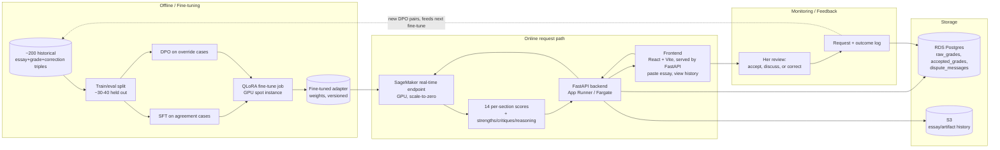

# AP Lit Essay Grader

<!--
This document is structured as frozen + living sections.

[frozen] sections capture decisions made at scoping time. They are immutable.
If a frozen decision changes, that's a re-grill, not an edit. The Decisions log
captures the change with a date and reason. The original section stays.

[living] sections reflect current state and are updated as the project progresses.
Claude Code maintains living sections during implementation. Always update the
last_updated date when changing a living section.
-->

## Why  [frozen]

### End goal

Your wife pastes a student essay into an app and gets back scores + improvement-oriented comments for every section of the school's actual AP Lit essay rubric (Thesis, Body Paragraph #1's Claim/Evidence 1/Reasoning 1/Evidence 2/Reasoning 2/Synthesis, Body Paragraph #2's same six, Conclusion — each 1-4, or flagged as missing when the essay doesn't address that criterion at all) without opening Claude.ai and re-explaining the rubric each time. This replaces an existing informal workflow (grading via raw Claude/ChatGPT conversations) that has a known, specific failure: models struggle to cleanly separate a 3 from a 4 on individual criteria, especially Evidence, which is her current lowest-trust section. The tool is built for her class today, with an explicit eye toward generalizing to other teachers and possibly commercializing later — but that generalization is not assumed to work automatically (see Deliberately deferred).

### Why now

Prior informal grading attempts (raw OpenAI API and raw Claude) were unsatisfying: OpenAI's model graded poorly overall, and Claude specifically struggled to differentiate adjacent scores (3 vs. 4) on rubric criteria. A fine-tuning pass targeted specifically at this known failure mode, using ~200 of her own real (essay, Claude's grade, her correction) triples as training signal, is a tractable, scoped way to fix the actual problem rather than hoping a better prompt fixes it.

### Business metric

Weekly active usage: did she (and eventually other teachers) open the app and grade at least one essay in a given week. This is the adoption/retention signal — a model that grades well but that she doesn't keep using has not achieved the end goal.

Secondary/diagnostic metric: time spent per grading session, expected to trend down as the fine-tune internalizes her grading style. This metric is explicitly *not* allowed to stand alone — a falling time-per-essay paired with a rising override rate would indicate she's rubber-stamping output rather than reviewing carefully, which is a failure, not a success. Time-per-essay is only trustworthy when read alongside override rate/magnitude.

### Expected lift over heuristic baseline

Two heuristic baselines, tracked separately because they answer different questions:

1. **Claude API zero-shot** (no fine-tuning) — the real-world floor. If the fine-tuned open model can't beat this, the honest conclusion is "don't self-host, just use the Claude API directly."
2. **Chosen open-weight base model, zero-shot** (before LoRA/DPO) — isolates whether fine-tuning itself did anything, separate from base model strength.

Both are already known to have the adjacent-score-boundary problem (per your wife's direct experience with Claude specifically). Expected lift is not "better on average" — it's specifically "better at separating adjacent scores (e.g. 3 vs. 4) on individual rubric criteria." A generic aggregate accuracy improvement that doesn't touch the boundary-confusion problem does not count as success (see Kill criteria in Phase 2, and Decisions log).

## What  [frozen]

### Models

#### ap-lit-grader

**Decision the model informs**: What score (1-4), or a missing flag, and structured improvement feedback to assign to each section of a student's AP Lit essay, evaluated against the school's real classroom rubric.

**Chosen ML framing**: Single model, single-turn, structured generation. Given (essay text, rubric), the model outputs 14 sub-scores — one per rubric criterion: Thesis, Body Paragraph #1 × 6 criteria (Claim, Evidence 1, Reasoning 1, Evidence 2, Reasoning 2, Synthesis), Body Paragraph #2 × the same 6, Conclusion — each either a 1-4 scale or an explicit "missing" flag when the essay contains no content addressing that criterion. Per-criterion output is structured, not a single rationale blob: a `strengths[]` list, a `critiques[]` list, and a separate `reasoning` field explaining how the score was derived against the rubric's score-band boundaries (this last field is what lets her see *why* the model landed where it did when she disagrees — see Data model below). All generated in a single call when the full essay is provided. Fine-tuned via QLoRA (PEFT) using SFT on agreement cases (she accepted Claude's original grade) and DPO on override cases (her correction preferred over Claude's original grade) — roughly 200 historical triples, ~70% override / ~30% agreement.

**Rejected framings**:

| Framing | Why rejected |
|---|---|
| Two-model split (separate scorer + comment generator) | Unnecessary — one fine-tuned model can generate structured score + rationale in one call; no upstream/downstream dependency exists between "what's the score" and "why." |
| Holistic single 0-6 score (original brief's assumption) | Does not match reality. The actual rubric is 14 per-section criteria scored 1-4 each; there is no official AP exam 0-6 conversion in use. Corrected during scoping (see Decisions log). |
| Multi-turn conversational grading (preserving the back-and-forth from historical Claude conversations) | Serving format is locked as single-turn (essay + rubric in, result out). Training examples use the *resolved end-state* of the historical back-and-forth (her final score + reasoning), not the intermediate argument, to keep training-serving parity. The live, in-app version of this back-and-forth (the dispute/discussion flow) is a separate, explicit UI feature — see UI/UX design below — not a return to multi-turn serving. |
| Rubric negotiation chat before grading | Reopens the locked single-turn serving format and has zero training-data coverage (all 200 historical triples used one fixed rubric). Deferred as a Phase 2+/commercialization feature for multi-teacher use, not built now. |

**Functional requirements**:
- Given a full essay + the fixed AP Lit classroom rubric, return all 14 per-section outputs (each a 1-4 score, or a missing flag) plus structured `strengths[]`, `critiques[]`, and `reasoning` in one generation.
- Each per-criterion output must include enough span/location information (e.g. character offsets into the submitted essay) for the UI to anchor its feedback next to the exact text it refers to. Exact mechanism (model-emitted offsets vs. a separate alignment step) is an open question — see Open questions.
- A criterion must be distinguishable as "missing" (no content in the essay addresses it) from "present but weak" (scored 1). These are different signals for both the teacher and the training pipeline and must not collapse into the same score.
- Support partial-essay grading (e.g., evidence-only, thesis-only, or any combination of individual criteria) via prompt routing to a subset of the same rubric structure. This mode is functionally supported in Phase 1 but explicitly **unvalidated** — no training data or held-out eval coverage exists for it yet (see Open questions).
- Capture her full review outcome after every grading — not just the final accepted/corrected score, but the complete discussion transcript when she disputes a score, since the transcript (not just the outcome) is what makes a correction usable as training signal. See Data model below for the storage shape this implies.

**Non-functional requirements**:
- Latency: synchronous request/response, up to ~60-90s worst-case tolerable (covers cold start on a scale-to-zero endpoint), with a visible loading state in the UI.
- Volume: single teacher initially (low, bursty traffic — grading happens in sessions, not continuously), designed to extend to a handful of teachers later.
- Retraining cadence: not fixed — re-fine-tune as enough new corrected triples accumulate post-launch (flywheel via feedback capture).
- Reliability: no formal SLA (n=1 user); failure mode should be a visible error state in the UI, not a silent hang.

## How  [living, last_updated: 2026-08-11]

### Methodology

**Label**: On override cases (~70% of the ~200 triples), the label is her corrected score(s) + her corrected rationale — this is a DPO preference pair (rejected: Claude's original grade, preferred: her correction). On agreement cases (~30%), the label is Claude's original grade, treated as an SFT confirmation example (no preference pair, since there was no disagreement). All labels are per-section (14 sub-scores), not a single holistic number. How a "missing" criterion should be weighted in training and in QWK reporting (e.g. does a corrected missing→1 count as an override case the same way a corrected 3→4 does) is not yet decided — see Open questions.

**Leakage audit**: Feature set is essay text + fixed rubric only. Historical grading conversations were confirmed to be "grade this essay against the rubric, then back-and-forth on why the grade was wrong" — no student identity, history, or other out-of-band context was included, so there is no leakage risk from those sources. The back-and-forth itself is not used as training input (see training-serving parity below); only the resolved final state is.

**Population match**: All ~200 training triples are from your wife's own classes and assignment prompts. This is expected and correct for Phase 1 (the fine-tune is intentionally her personal grading-style delta). Explicit limitation: this is *not* a generalized AP Lit grader — if Phase 2 expands to other teachers with different rubrics or grading philosophies, the model may need retraining or a different approach per teacher. Not assumed to generalize automatically.

**Feature engineering**: None beyond the essay text and the fixed rubric text baked into the prompt template. Rubric is a constant for Phase 1, not a variable input — no parity risk there.

**Model family**: 7-8B open-weight instruction-tuned LLM, QLoRA/LoRA fine-tuned (SFT + DPO via PEFT/TRL). Base model choice is being hedged in Phase 0 between **Qwen2.5-7B-Instruct** (Apache 2.0 license, model card explicitly targets structured/JSON-style output which matches the 14-sub-score generation requirement) and **Llama 3.1 8B** (larger fine-tuning community/tooling maturity, Meta's custom license with a 700M MAU commercial cap that doesn't bite at this scale but is worth reviewing before any commercialization). Decision will be made from real zero-shot output quality on the same essay sample, not from benchmarks alone.

**Training-serving parity**: Training examples are built from the *resolved end-state* of historical multi-turn grading conversations (essay, rubric → her final per-section scores + rationale), matching the single-turn serving format exactly. The intermediate back-and-forth argument is a source for constructing DPO pairs (Claude's initial guess = rejected, her final = preferred) but is not itself part of any training example's input. The in-app dispute feature (see UI/UX design) is the live equivalent of this historical back-and-forth, and is what will generate this same shape of data going forward.

### Data model

Discovered while designing the UI's dispute/correction flow: "the model's original grade" and "the score that actually counts" need to be two different records, not one row with a status flag, because they have different write behavior and different consumers.

- **`raw_grades`** — append-only event log. One row per model generation: the initial grade, any re-grade, and any score Claude proposes mid-dispute. Never edited. Written automatically the moment Claude responds — this is a system event, not a teacher decision, so it autosaves with no confirmation step.
- **`accepted_grades`** — also append-only, read as "latest row per (essay, criterion) wins." One row per explicit teacher action: her initial silent acceptance (created in bulk the moment she hits "Finish grading" on an essay, for every criterion she never disputed) or a deliberate "Save correction" inside a dispute thread. Each row carries a foreign key back to the `raw_grades.id` it's confirming or correcting, which is what turns "she picked 3" into a usable DPO pair — the FK points at exactly which model output is the rejected side. This table is the one source of truth for "what score does this essay currently show," and per the autosave-vs-explicit-save principle below, it is never written to implicitly.
- **`dispute_messages`** — one row per turn in a discussion thread, scoped to (essay, criterion). This is what makes a correction legible later: `accepted_grades` says "3, not 4," `dispute_messages` says why.

An **agreement case** (SFT) is an `accepted_grades` row whose `raw_grade_id` FK points to a raw score that matches the accepted value. An **override case** (DPO) is where they differ. No separate classification logic is needed — it falls out of comparing the two tables.

**Autosave-vs-explicit-save principle** (governs all of the above): system-generated events autosave with no confirmation, because there's no ambiguity about intent and no downstream training-data event tied to a single click. Anything that becomes the *operative* score — shown to the student, feeding the essay's overall grade, or entering the training pipeline as a preference label — requires a deliberate action, because exploratory clicking (comparing 2 vs. 3 vs. 4 against the rubric) is expected, legitimate behavior that must not each independently commit a training label.

### System architecture

### UI/UX design

Fully designed during a dedicated UI session; a working interactive mockup (`ap-lit-grader-full-flow.jsx`) and a full design/interaction handoff doc (`UI-DESIGN-HANDOFF.md`) exist alongside this README and are the source of truth for frontend implementation. Summary for context:

- **Flow**: one-time-per-batch assignment setup (which criteria to grade, the prompt, the class) → a cached session bar shown above every subsequent essay so she never re-answers "what am I grading" per essay → paste essay → loading (real elapsed-time counter, no fake progress bar, since actual duration is variable) → full graded view → "Finish grading" (which is also the moment untouched criteria get bulk-accepted into `accepted_grades`) → straight into the next essay, cached bar intact.
- **Grading view**: all 14 criteria shown expanded simultaneously, grouped by essay part (Thesis / Body ¶1's six / Body ¶2's six / Conclusion) rather than one flat list, each with its own strengths/critiques, a collapsed "show model's reasoning" disclosure, and its own independent dispute thread.
- **Dispute feature**: this is the productized replacement for the ad-hoc Claude.ai back-and-forth described in Why Now. She can discuss any single criterion with Claude and, at resolution, must explicitly pick and save a final score — Claude's own proposed score is never auto-applied.
- **Missing-criterion handling**: visually and linguistically distinct from a low score everywhere it appears (a `!` marker instead of a number, a dashed inline placeholder in the essay itself where the missing content should have been, different copy in the margin card and in the simulated dispute reply).
- **Design system**: warm paper surface for the essay itself (legibility takes priority over theme), a pale lavender chrome, a dark plum accent card for feedback and system chrome, Fraunces (serif) for the essay body, Inter for UI text, Caveat (handwritten) reserved for small flourishes only, never for anything that needs to be read carefully.

## Offline-to-business validation plan

Claim: closing the per-section adjacent-score gap (e.g. 3 vs. 4, especially on Evidence, her current lowest-trust criterion) is what converts "I'll double-check everything myself" into "I trust this enough to review and adjust." A generic aggregate QWK improvement that doesn't touch adjacent-score confusion is not expected to move usage.

Since there's no real production A/B traffic (single user), validation is: after each fine-tuning iteration, (1) run the held-out eval and report per-criterion QWK + adjacent-pair (3-vs-4, etc.) confusion matrices, and (2) directly ask her whether that version's output feels trustworthy enough to rely on for boundary cases — a qualitative check that, at n=1, is more direct signal than any offline number alone.

Re-confirmed late in scoping (after the real rubric was discovered) — the causal story held up: per-section boundary accuracy, not a holistic score, is what needs to improve, and Evidence specifically is her known trust gap.

### Tech stack

| Layer | Choice | Why |
|---|---|---|
| Frontend | React (Vite) + TypeScript + Tailwind, built to static assets and served by the FastAPI backend as one deployable | Simplest ops story for a single-teacher tool with no auth planned yet (one App Runner service, no CORS config); splitting to S3/CloudFront is a clean later migration if Phase 2+ adds auth/multi-tenancy. D3/recharts available for Phase 2 progress-tracking charts. |
| App backend | FastAPI on App Runner (or ECS Fargate) | AWS-native, reinforces existing resume line, simple deploy for a single grading endpoint |
| Database | RDS Postgres | Structured storage for `raw_grades`, `accepted_grades`, `dispute_messages` (see Data model), plus Phase 2 pseudonymous per-student history |
| Object storage | S3 | Raw essay/artifact history |
| Inference | SageMaker real-time endpoint, GPU (e.g. ml.g5.xlarge), scale-to-zero | SageMaker Serverless Inference is CPU-only with a 6GB memory ceiling — cannot host a 7-8B model. Scale-to-zero real-time endpoint matches bursty, low-volume traffic while staying GPU-backed and AWS-native. |
| Fine-tuning | LoRA/QLoRA via PEFT; DPO on override pairs, SFT on agreement cases; TRL/Axolotl tooling | Matches ~200-example dataset size and 1-week timeline; DPO pairs come directly from her real corrections |
| Base model (hedged) | Qwen2.5-7B-Instruct vs. Llama 3.1 8B, decided in Phase 0 | Qwen: Apache 2.0, structured-output design. Llama: larger community/tooling. Testing both is cheap and was an explicit skill-building goal. |

### Cost estimate

- **Inference (scale-to-zero, light bursty usage)**: ~$5-15/month on the SageMaker endpoint itself
- **Rest of stack (RDS, S3, App Runner/Fargate)**: ~$20-35/month combined
- **Training**: ~$5-20 per QLoRA/DPO run on a GPU instance (spot where possible); expect several runs while iterating, ~$50-100 one-time across the dev cycle
- **Total estimated**: ~$25-50/month steady-state + ~$50-100 one-time training cost. Not a meaningful constraint on this project.

### Phased plan

#### Phase 0 — Smallest end-to-end slice
**Goal**: Prove the full pipeline (data → model → serving → consumer) can be assembled at all, in parallel with learning QLoRA/DPO.
**Deliverables**: Zero-shot (non-fine-tuned) Qwen2.5-7B-Instruct *and* Llama 3.1 8B deployed on SageMaker real-time scale-to-zero endpoints; bare FastAPI endpoint; minimal frontend (even raw HTML); tested against 3-5 real essays. Produces the zero-shot baseline numbers for both candidate base models.
**Kill criteria**: If SageMaker real-time scale-to-zero can't reliably host either 7-8B model within a reasonable cold-start window, reassess hosting choice (e.g. always-on with a stop/start schedule, or Bedrock Custom Model Import) before proceeding.

#### Phase 1 — Grading + comments, full essay, single teacher
**Goal**: Working app that grades full essays against the real rubric (all 14 per-section outputs + structured feedback), fine-tuned on your wife's ~200 historical triples, used by her directly. Full UI already designed — see UI/UX design above and `UI-DESIGN-HANDOFF.md`.
**Deliverables**: FastAPI backend + SageMaker fine-tuned endpoint + the designed React frontend + RDS/S3 logging + feedback capture (accept/discuss/correct, per the `raw_grades`/`accepted_grades`/`dispute_messages` data model) built in from the start. Held-out eval (~30-40 essays, curated for adjacent-score coverage) reporting per-criterion QWK, adjacent-pair confusion matrices, and exact/off-by-one accuracy, compared against both heuristic baselines (Claude API zero-shot, chosen base model zero-shot).
**Kill criteria**: If, after a full SFT+DPO pass, the held-out eval shows no measurable improvement over baseline on adjacent-score (e.g. 3-vs-4) boundary accuracy across rubric criteria, treat the grading-model approach as not working — pivot to a different value-add (e.g., comments-only without a hard score, or lean into progress-tracking as the real product) rather than continuing to iterate on the same fine-tune blindly.

#### Phase 2 — Pseudonymous per-student progress tracking
**Goal**: Let her see how a given (pseudonymous) student's per-section scores trend across multiple graded essays over time.
**Deliverables**: `students` table (pseudonymous IDs only, no real names/school IDs — real-name mapping stays outside the system), essays linked by student_id, progress-view UI.
**Kill criteria**: Not started until Phase 1's grading quality is solid and she's used it for several real weeks — building this before grading is trusted risks tracking progress against an untrustworthy signal.

### Definition of done

Phase 1 is "shipped" when your wife can paste a real essay into the deployed app, receive per-section scores + structured feedback against the real rubric within the latency budget, her review (accept/discuss/correct) is captured with full transcript, and the held-out eval shows measurable adjacent-score-boundary improvement over both baselines.

## Decisions log

- **2026-08-11**: Project scoped via grill-me. Locked end goal (per-section grading + comments, weekly-usage business metric), single-model topology, SageMaker real-time scale-to-zero GPU endpoint (Serverless Inference ruled out — CPU-only, 6GB cap), pseudonymous student IDs (FERPA/SOPPA-aware), Phase 1 (grading) vs. Phase 2 (progress tracking) split, QWK-based eval protocol, and Phase 0 base-model hedge (Qwen2.5-7B-Instruct vs. Llama 3.1 8B).
- **2026-08-11**: Mid-scoping correction — original brief assumed a holistic 0-6 AP-exam-style rubric. Actual rubric (uploaded by user) is a ~10-criterion, 1-4-per-criterion classroom rubric with no official AP exam score conversion in use. All label, eval, and off-ramp decisions revised to per-section 1-4 scale.
- **2026-08-11**: UI design session. Corrected rubric structure — each body paragraph has 2 pieces of evidence and 2 pieces of reasoning, not 1 each, bringing the true criterion count to 14, not ~10. All references updated. Locked the per-criterion structured output shape (`score|missing`, `strengths[]`, `critiques[]`, `reasoning`) in place of a single rationale blob — the separate `reasoning` field exists specifically to support the in-app dispute feature and downstream DPO-pair construction. Added explicit "missing" as a distinct state from a low score. Designed and locked the full UI flow, the `raw_grades`/`accepted_grades`/`dispute_messages` data model, and the autosave-vs-explicit-save principle (see Data model and UI/UX design above). Chose React (Vite) + TypeScript + Tailwind, served from FastAPI as one deployable, as the frontend stack.

## Open questions

- Partial-essay grading (evidence-only, thesis-only, etc.): functionally supported via prompt routing in Phase 1, but has zero training data or eval coverage. Quality is unknown and unvalidated. Improving this is flagged as a future project.
- Whether Qwen2.5-7B-Instruct or Llama 3.1 8B wins the Phase 0 hedge, and why — to be resolved with real output comparison, not decided yet.
- Multi-teacher generalization mechanics (retrain per teacher? one shared model? rubric-negotiation chat?) — explicitly deferred, not designed.
- How a "missing" criterion should be treated in QWK and other eval metrics, and whether a corrected missing→N counts as an override case the same way a corrected 3→4 does — not yet decided.
- Whether the essay-text span/offset linking each criterion to the exact sentence(s) it refers to should be emitted directly by the model, or computed as a separate post-hoc alignment step — not yet decided, and blocks a clean implementation of the highlighting UI already designed.

## Deliberately deferred

- **Second human grader / inter-rater agreement ceiling**: would strengthen the eval (knowing the human-human agreement ceiling avoids chasing an unrealistic target), but not available now. Revisit later.
- **Rubric-negotiation chat for other teachers**: a real Phase 2+/commercialization feature, but conflicts with the locked single-turn serving format and has no training coverage. Deferred.
- **Hyperparameter strategy for LoRA/DPO runs**: normal implementation-time decision, not a scoping decision.
- **Specific RDS schema, exact App Runner vs. Fargate choice**: below deployment-shape level, resolved during build.
- **Cost optimization beyond order-of-magnitude estimate**: cost is not a binding constraint at this scale; no need for a detailed model now.
- **Commercialization / selling to a school or company**: named as the "next thing" (Q6) if Phase 1 succeeds and the 6-month re-evaluation checkpoint is positive, but out of scope for this build (no auth, multi-tenancy, billing, or institutional FERPA compliance work planned now).
